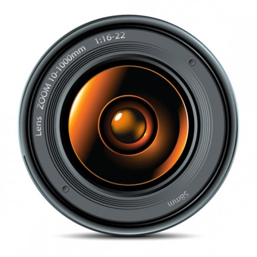

# Stockfree 

> The word design is everything and nothing. The design and the product itself are inseparable. Strong design is based on strong imagery. Unfortunately, strong imagery requires a good photographer and that costs money. In the past we were limited to stock photography sites that charge a lot or absolutely terrible free stock photography that cost you conversions but things have chnaged and we have this ultimate collection of free  images for you. 

## Images 
- [StockSnap](http://StockSnap.io) - Beautiful free stock photos
- [Unsplash](http://unsplash.com/) - Unsplash is a collection of free high-resolution photos and has arguably become the best source for stock images.
- [Gratisography](http://www.gratisography.com/) - Gratisography offers free high-resolution pictures you can use on your personal and commercial projects.
- [Negative Space](http://negativespace.co/) - Negative Space provides 20 new photos every week released under Creative Commons CC0. 
- [Wallions](http://wallions.com/) - Images for billions
- [Splitshire](http://splitshire.com/) - Splitshire is a collection of delicious free stock photos by web deisgner Daniel Nanescu. 
- [Littlevisuals](http://littlevisuals.co/) - This mention comes with a bit of sad news. The owner of the site Nic passed away and thus no longer provides new pictures.
- [Life of Pix](http://www.lifeofpix.com/) - Life of Pix is a resource created by the LEEROY creative agency offering free high-resolution photos with no copyright restrictions.
- [Death to Stock Photos](http://deathtothestockphoto.com/) - Every month a photo pack of 10 photos within a certain category will be delivered to your inbox
- [Super Famous](http://superfamous.com/) - Superfamous is the Los Angeles-based studio of Dutch interaction designer Folkert Gorter.
- [Pic Jumbo](http://picjumbo.com/) - Picjumbo is a collection of totally free photos for your commercial & personal works. 
- [I am Free](http://www.imcreator.com/free) - A curated collection of free resources, all for commercial use, some photos may require attribution.
- [New Old Stock](http://nos.twnsnd.co/) - Vintage photos from the public archives free of known copyright restrictions.
- [Getrefe](http://getrefe.tumblr.com/) - Free mobile photos for your personal or commercial projects.
- [Lock & Stock Photos](http://lockandstockphotos.com/) - Lock & Stock Photos are the works of AJ Montpetit. 
- [re:splashed](http://www.resplashed.com/) - re:splashed is a collection of a little over 600 free high definition images sourced by the fine folks at Crew.
- [Snapwire Snaps](http://snapwiresnaps.tumblr.com/) - Get 7 free photos every 7 days. Photos are public domain and free from copyright restrictions.
- [Jaymantri](http://jaymantri.com/) - 7 new photos released every Thursday under the Creative Commons CC0 license
- [Tookapic Stock](https://stock.tookapic.com/?filter=free) - Tookapic stock is a marketplace for both free & premium stock photos.
- [Je Shoots](http://jeshoots.com/) - Cool & free photos for You! Photos for business or personal use in high resolution for free.
- [Cupcake](http://cupcake.nilssonlee.se/) - All photos here on cupcake are licensed under the Creative Commons license CC0,
- [Shutteroo](http://shutteroo.com/) - Free images, no worries
- [Huney](http://huney.co/) - Free High Resolution Photos
- [MMT](http://mmt.li/) - MMT is an up-and-coming free stock photography site run by Jeffrey Betts. 
- [Skitter Photo](http://www.skitterphoto.com/) - All photos on this website are completely free to use for any purpose
- [Free Nature Stock](http://freenaturestock.com/) - Royalty-free Nature Stock Photos. Use them however you want. Created by Adrian Pelletier. 
- [Picography](http://picography.co/)- If you’re looking for a photo in a hurry, this definitely isn’t the site for you.
- [Travel Coffee Book](http://travelcoffeebook.com/) - The team behind Travel Coffee Book are committed to bringing you beautiful moments from all around the world. 
- [Startup Stock Photos](http://startupstockphotos.com/) - Startup Stock Photos is the answer to the question: Where can I find business-themed photos that aren’t horrendously cringe-inducing?
- [Splitshire](http://www.splitshire.com/) - SplitShire is the side project of Daniel Nanescu, a graphic designer from Torino in Italy
- [Move East](http://moveast.me/) - Moveast is the visual diary of a Portuguese man moving to Dubai.
- [Gratisography](http://gratisography.com/) - It’s collection is pretty small but its eclectic images are all fantastic quality and massively usable
- [Insta Stock](http://instastock.co/) - InstaStock is half visual diary and half stock photography gallery. All images are taken by Dylan Simel 
- [SpaceX photos](https://www.flickr.com/photos/spacexphotos/17127808431/) - As if SpaceX could get any cooler, they’ve just started releasing photos for free.
- [Fancy Crave](http://fancycrave.com/) - Fancy Crave are purveyors of fine imagery for designers, developers, artists and creatives. 
- [Big Foto](http://www.bigfoto.com/) - Since its launch in 2000, BigFoto has offered royalty-free images across a relatively small range of images. 
- [Nabeel Syed](http://nabeelsyed.com/) - While Nabeel claims to be a mechanical engineer by trade and a patent agent-in-training, he’s quite clearly destined to become a photographer. 
- [Raumrot](http://www.raumrot.com) - Handcurated and free stock free images
- [Freerange Stock](https://freerangestock.com/) - Freerange Stock is a manually curated and extensively keyworded collection of quality high-res free photos.
- [Magdeleine](http://magdeleine.co/) - Magdeleine is a gallery of handpicked stock photographs. 
- [Skuawk](http://skuawk.com/) - Skuawk Piblic domain photos. Free, beautiful and artistically loud
- [UnHD Wallpapers](http://www.uhdwallpapers.org/p/creative-commons-images.html)- Gallery contains a top with 30 high quality pictures for download under various Creative Commons licenses.
- [Stock Photos IO](http://stockphotos.io/) - StockPhotos is a collection of high quality images released under Creative Commons Zero deed. 
- [Kaboom Pics](http://kaboompics.com/) - Great place to get breathtaking Free Pictures for business or personal projects /
- [Foodies Feed ](http://foodiesfeed.com/) - Free food pictures
- [ISO Republic](http://isorepublic.com/) - ISO Republic is an exclusive – and free – stock photography site for creatives. The site was founded by designer Tom Eversley back in 2014
- [Albumarium](http://albumarium.com/) - Albumarium provides outstanding selection of images across a pretty decent range of categories, including animals, nature and buildings.
- [Open Photo](http://openphoto.net/) - The Open Photo Project is a photo sharing platform created in 1998 by Michael Jastremski. 
- [Morgue File](http://www.morguefile.com/) - Free photo archive
- [Public Domain Archive](http://publicdomainarchive.com/) - Everything you need for your creative projects, all public domain images!
- [Photogen](http://www.photogen.com/) - Photogen for quality, high-res FREE stock photos and images
- [Pixabay](http://pixabay.com/) - Free images and videos you can use anywhere
- [Public Domain Photos](http://www.public-domain-photos.com/) - 5000 Free Stock Photos
- [Dot Spin](http://www.dotspin.com/the-commons/) - The Marketplace for Instagram Photos
- [We Function](http://wefunction.com/category/free-photos/) - Free photos from we function
- [Libreshot](http://libreshot.com/) - Beutiful photos, totally free
- [Pexels](http://www.pexels.com/) - Best free stock photos in one place
- [Stokpic](http://www.stokpic.com/) - Free Stock Photos For Commercial Use
- [Dreamy Pixel](http://dreamypixel.com/gallery-of-free-photograhs-images/) - Dreamy Pixel offer 3 new images each week that may be used freely and without attribution for any purpose 
- [The Pic Pac](http://thepicpac.com/) - Do whatever you want to with the pics
- [Photo Crops](http://www.photocrops.com/) - Photos to use any way you choose.
- [Free Stock Paradise](http://www.freestockparadise.com/) - Free high resolution photos to do whatever you want with.
- [Stocka](http://www.stocka.co/) - Stocka.co wants to be your source for free stock photos
- [Photo Collections](http://photocollections.io/) - Free High Resolution Stock Photography.
- [CCO](http://cc0.photo) - Public domain photos 
- [Barn Images](http://barnimages.com/) - Launched by Igor Trepeshchenok and Roman Drits, two photographers from Latvia
- [Free Images Red](http://creativecommons.photos/) - Search high quality free images with creative commons Zero CC0 license.
- [Stock Vault](http://stockvault.net/) - Free stock images
- [Free Images](http://freeimages.com/) -  Free stock images
- [Snap Wire](https://www.snapwi.re/) - Get custom photos from 243,219 of the world's top photographers
- [Wine Photo](http://www.winephoto.co/) - A free image gallery for the wine industry. Produced and maintained by Nixie Agency
- [4 FREE PHOTOS](http://www.4freephotos.com/) - Free iamges
- [Good Stock](http://goodstock.photos/) - Free stock images, that you can use anywhere for anything
- [Designers Pics](http://www.designerspics.com/) - FREE Hi-Res photos for your personal & commercial use. Attribution not required!
- [Valle Studio](http://vallestudio.com/) - Free stock images
- [Lobster](http://lobster.media/marketplace) - Find the perfect one for you and get it from areal person.
- [Good Free Photos](https://www.goodfreephotos.com) - Thousands of public domain stock photo categorized by geographic location.

# Videos 
- [Creative Common Videos](https://creativecommons.org/videos/)
- [Coverr](http://www.coverr.co/) - Beautiful, free videos for your homepage
- [Videvo](http://www.videvo.net/) - Free HD stock footage & motion graphics for any project!
- [XStockvideo](http://www.xstockvideo.com/) -Free HD videos loops for awesome landing pages
- [Life of Vids](http://www.lifeofvids.com/)
- [Vimeo CC](https://vimeo.com/creativecommons)
- [Flickr CC](https://www.flickr.com/creativecommons/by-2.0/)
- [Maker TV](http://www.maker.tv/)
- [VideoBlocks](https://www.videoblocks.com) - Unlimited downloads of stock video & motion backgrounds]
- [Fancy Footage Club](http://fancyfootage.club/) - Looping, royalty-free videos for your next design project.

Note: Some of these sites also provide premium content. Please search and look for CC license. 

## Icons 
- [Prestashop Pack](http://build.prestashop.com/icon-pack)
- [Nova](http://www.webalys.com/nova/)
- [Icon Store](https://iconstore.co) - Free icon packs by first-class designers
- [Animaticons](http://animaticons.co/) - Beautiful, customizable animated GIF icons.
- [Freebbble](http://freebbble.com/) - 1000+ high-quality design freebies made by Dribbble users.]
- [Medialoot](http://medialoot.com/) - Thousands of fonts, icons, graphics, templates, & interfaces
- [Glyphs Company](https://glyphs.co) - A platform for beautiful icons.
- [Material Design Icons](https://github.com/google/material-design-icons/releases/tag/1.0.0) - 750 Free open-source glyphs by Google
- [To Icon](http://www.toicon.com/) - Icons for every season

## Logos 
- [Logo Dust](http://logodust.com/) - Free logo designs for your projects, added every week

## Fonts
- [Lost Type](http://www.losttype.com/) - Lost Type is a Collaborative Digital Type Foundry

## Collections 
- [Product Hunt collection](http://www.producthunt.com/@brandonjgeo/collections/stockstuff)

## License

To the extent possible under law, [Ravi Suhag](http://ravisuhag.com) has waived all copyright and related or neighboring rights to this work.

